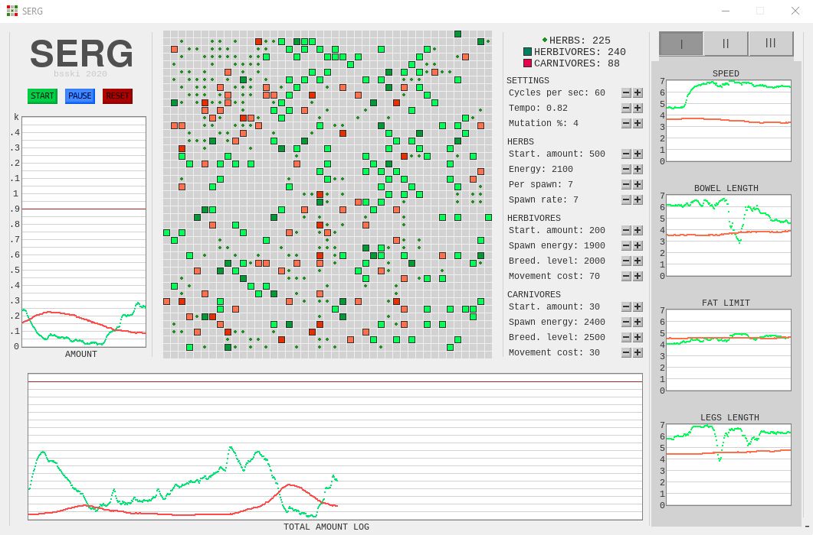

 

<b>
WARNING: VERY OLD CODE (04-06.2020)
</b>
<i>
This code was written in 2020. I have learned a lot since then and I am aware of the poor quality of the code.
</i>

 

  <h2 align="center">SERG </h2>

## Table of contents
* [Project description](#scroll-project-description)
* [SERG's interface](#fireworks-serg's-interface)
* [Technologies used](#hammer-technologies-used)
* [Room for improvement](#arrow_up-room-for-improvement)
* [Contact](#telephone_receiver-contact)
* [Changelog](#chart_with_upwards_trend-changelog)
* [Author](#construction_worker-author)
* [License](#unlock-license)

## :scroll: Project description
SERG (Symulator Ewolucyjnej Rywalizacji Genów) is an artificial life simulator inspired by The Game of Life cellular automata. It simulates interaction between herbivores and carnivores in an environment. The animals can move, eat and reproduce. They have their own DNA, in which the values of their traits are coded: speed, length of intestine, limit of fat tissue and length of legs. Trait values affect animal behavior and their ability to survive and reproduce. Animals inherit traits from their parents, with a certain chance of mutation of genes. The project was made entirely in pygame.

## :fireworks: SERG's interface

## :hammer: Technologies used
- Python 3.7
- Pygame 2.1.2

## :arrow_up: Room for improvement
This is an old project of mine and it would certainly benefit from:
- refactoring the code into better functions,
- refactoring the code into different files,
- getting rid of many anti-patterns,
- having tests written for it.

## :telephone_receiver: Contact
- <contact.bsski@gmail.com>

## :chart_with_upwards_trend: Changelog

:date: **22.08.2020**
- added information about settings and settings changes to a report file

:date: **01.08.2020 - 05.08.2020
| Bar plots**
- added bar plots of herbivores' and carnivores' traits distribution
- interface changes
- changed effective range of herbivores' and carnivores' smell, so that it is now possible for carnivores to sneak up on herbivores
- fixed a few minor bugs

:date: **11.07.2020 - 14.07.2020**
- added following/escaping mechanism: carnivores now follow herbivores/carnivores depending on intention, herbivores now escape from carnivores or follow herbs/herbivores, depending on intention
- fixed major bug causing herbs, herbivores and carnivores positions to save in one list
- minor logo tweak

:date: **10.06.2020, 11.06.2020**
- added plus and minus buttons for every value in the interface
- resized all charts and made them fit the window better

:date: **30.05.2020**
- added exporting data to a txt file

:date: **25.05.2020**
- added history of mean amounts of herbivores and carnivores chart

:date: **24.05.2020**
- standardized starting amount of objects

:date: **21.05.2020**
- separated simulation speed from FPS, from now on SERG's interface runs on steady 30 FPS
- added an anti-hanging and lag indicating mechanism

:date: **20.05.2020**
- fixed major bug that was causing problems with excessive breeding and resetting
- interface changes

:date: **19.05.2020**
- further steps towards code compatibility with PEP8
- the higher animal's trait rank, the bigger its movement cost
- added proto-charts

-break-

:date: **12.05.2020**
- some steps towards code compatibility with PEP8
- if an animal dies, a herb will appear on the field it died on

:date: **11.05.2020**
- new interface
- the animals can only have 2 shades of red/green now:
      fair if they are hungry,
      dark if they are ready to breed

:date: **08.05.2020**
- implemented a better movement method

:date: **07.05.2020**
- color of the animal depends on its DNA sum now - the higher the darker
- animals won't go to the last tile they were on now
- added legs length trait

:date: **06.05.2020
| New traits**
- fixed critical birth bug 
- added bowel length trait
- added fat limit trait

:date: **05.05.2020**
- chunks update planning (optimization attempt - failed)

:date: **04.05.2020
| Inheritance**
- fixed pause+clean bug
- added inheritance of genes
- added possibility of mutation

-break-

:date: **28.04.2020
| Tempo**
- modified delta_t time regulation to fit the task better
- added tempo regulation through buttons
- minor interface changes
- fixed cleaning issue

:date: **27.04.2020
| Buttons I**
- created a few button sprites and added them
- added plus, minus, start, pause and clean buttons
- start, pause and clean buttons work

:date: **26.04.2020**
- fixed herbs not spawning on some fields

:date: **25.04.2020
| Optimization II**
- optimized eating and breeding for both carnivores and herbivores
- color of animals depends on their energy level
- new layout design changes

:date: **24.04.2020
| Optimization I**
- limited amount of herbs to 1 per field
- extraction of main settings to the begginning of the program
- started working on optimization of breeding process
- added logo

:date: **23.04.2020
| Carni&herbi**
- divided animals into carnivores and herbivores
- carnivores eat herbivores
- preliminary balancing
- preliminary preparations for regulation of the speed of the simulation

:date: **22.04.2020
| Herbs, breeding, energy**
- added herbs class
- herbs spawn every X frames now
- animals can eat herbs now
- added movement energy cost
- added breeding

:date: **21.04.2020**
- adding new objects by key
- added coding of the traits using "DNA"
- increased grid size from 13x13 to 43x43

:date: **20.04.2020**
- created animal class
- calling objects from objects list
- animals can move now
- fixed irregular speeds problem, which was caused by dividing max_counter not by its divider

:date: **19.04.2020**
- setting intervals for particular objects
- added function creating a square moving randomly around the grid
- the square bounces off the edges now
- three squares moving randomly around the grid with different speeds, bouncing off the edges

:date: **18.04.2020**
- delta_t application test

:date: **17.04.2020**
- research about classes and its uses
- research about different methods to make events occur every X time: delta_t

:date: **16.04.2020**
- added 2 fields long "snake" walking through the grid
- created code to make events occur every X frames

:date: **15.04.2020**
- created four-dimensional list representing a grid with its content
- added coloring certain fields
- did research about using loops inside of the main PyGame loop
- added code that iterates over the fields and colors one at the time

:date: **14.04.2020**
- designed an interface for SERG

## :construction_worker: Author
- [@BSski](https://www.github.com/BSski)

## :unlock: License
MIT
